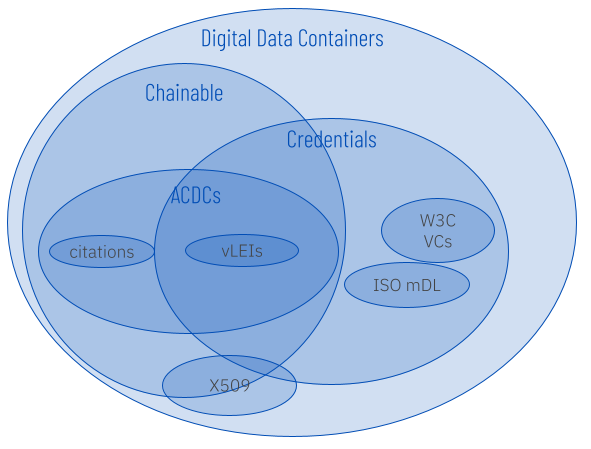

# Credentials

A credential proves that someone called an _issuer_ believes that someone called an _holder_ is entitled to a privilege. For example, a driver's license proves that government authorities consider its holder to be entitled to driving privileges.

When the holder of a credential presents it to achieve trust, the party that evaluates the credential as proof is called a _verifier_.

* Understanding digital credential (and non-credential) formats
* All about vLEIs
* How to issue or receive a credential
* How to verify or present a credential

To learn more about how to issue (or receive) credentials, see [Issuance Process](issuance.md). To learn more about how to verify (or prove with) credentials, see Verification Process.&#x20;

## Digital Credential Formats

Cryptography can be used to create digital versions of credentials. X509 certificates are a familiar example of first-generation digital credentials.

About a decade ago, work began on a second generation of digital credentials that solves some centralization and maintenance problems. This technology is called _verifiable credentials_, and is associated with [AnonCreds](https://hyperledger.github.io/anoncreds-spec/), the [ISO mobile driver's license spec](https://www.iso.org/standard/69084.html), and the [W3C verifiable credential spec](https://www.w3.org/TR/vc-data-model/). Origin can help support these technologies. However, the focus of Origin is a third generation of digital credentials called [ACDCs](https://trustoverip.github.io/tswg-acdc-specification/).

ACDCs have a richer and more flexible data model than simple VCs. They are more efficient with storage and network, and they are significantly more secure. They support more sophisticated signing, delegation, and revocation patterns. They are post-quantum ready. And they can also be used to create or cite verifiable data chains that are not intended to grant privileges (e.g., provably sourced scientific data or journalism, scholarly citations, financial or legal evidence). Although we might still casually refer to ACDCs as "credentials", ACDCs use cases are much broader.

<figure><figcaption></figcaption></figure>

Because ACDCs are not always issued to an individual human owner who wants privileges, we prefer the generic term _issuee_ rather than _holder_ to describe the party that receives them.

