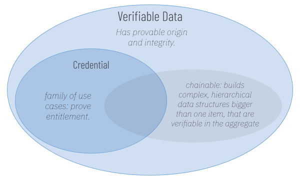

# Credentials and Verifiable Data

A _credential_ proves that someone called an _issuer_ believes that someone called an _holder_ is entitled to a privilege. For example, a driver's license proves that government authorities consider its holder to be entitled to driving privileges. When the holder of a credential presents it to achieve trust, the party that evaluates the credential as proof is called a _verifier_.

Credentials are a subset of a larger and more flexible category, verifiable data. Verifiable data can be applied to many use cases that are not focused on entitlement.

Some forms of verifiable data are chainable. This allows them to build larger data structures, which are verifiable in whole and in the individual parts.&#x20;

<figure><figcaption></figcaption></figure>
